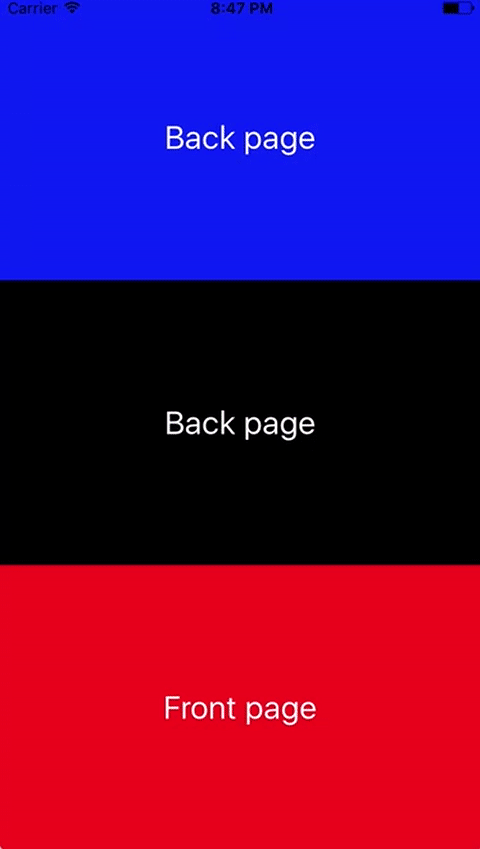

# react-native-flip-card-view
The purpose of application is to flip view between front page and back page for react native.

## Installation

```sh
npm install --save react-native-flip-card-view
```
## Demo


## Example

```js
import React, {Component} from "react";
import {View,Text} from "react-native";
import FlipCard from "react-native-flip-card-view"

export default class Demo extends Component {
  render = () => {
    return (
      <FlipCard style={{flex: 1}}
                    velocity={2} // Velocity makes it move
                    tension={5} // Slow
                    friction={1} // Oscillate a lot
                    renderFront={this._renderFront()} 
                    renderBack={this._renderBack()}/>
    );
  };
  //Desired screen view method in front page
  _renderFront() {
        return (
            <View style={{backgroundColor: 'red',flex:1,height:100}}>
                <Text>Hello front page</Text>
            </View>);
    }
  //Desired screen view method in back page
    _renderBack() {
        return (
            <View style={{backgroundColor: 'blue',flex:1,height:100}}>
                <Text>Hello back page</Text>
            </View>);
    }
 
}
```
